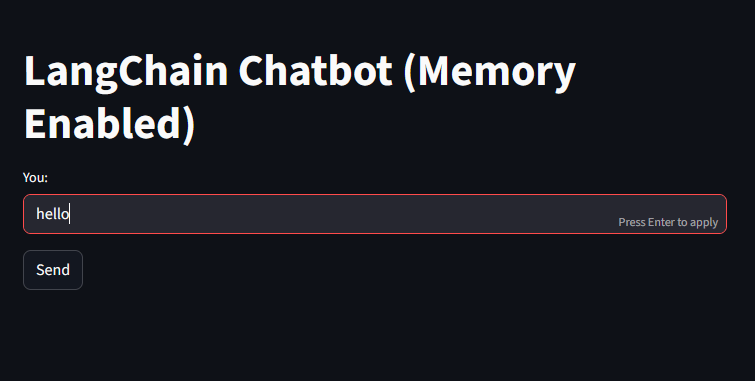

# AI_Chatbot With Memory

<p align="center">
  
</p>

This is a conversational AI chatbot built with Streamlit and LangChain, featuring persistent conversation memory and powered by Meta's Llama 3.1 8B model via Hugging Face.

Experience intelligent conversations with context-aware responses that remember your entire chat history. This lightweight yet powerful application combines the simplicity of Streamlit's web interface with the robustness of LangChain's conversation management, delivering seamless AI interactions powered by one of the most advanced open-source language models available.

Built for developers and AI enthusiasts who want a production-ready chatbot solution that's easy to deploy, customize, and extend. Whether you're prototyping conversational AI applications, building customer support tools, or exploring the capabilities of large language models, this chatbot provides a solid foundation with enterprise-grade memory management and real-time response capabilities.

## Features
- **Memory-Enabled Conversations:** Maintains context throughout the chat session
- **Modern UI:** Clean and intuitive Streamlit interface
- **Powered by Llama 3.1:** Uses Meta's state-of-the-art 8B parameter instruction-tuned model
- **Real-time Responses:** Interactive chat experience with loading indicators
- **Session Persistence:** Chat history maintained during the session

## Prerequisites
- Python 3.8 or higher
- Hugging Face account and API token
- Internet connection for model access

## Installation
1. **Clone or download the project files**
   ```
   git clone <your-repository-url>
   cd <project-directory>
   ```
2. **Install required dependencies**
   ```
   pip install streamlit langchain-huggingface langchain-core python-dotenv
   ```
3. **Set up environment variables**
Create a `.env` file in your project root directory:
   ```
   HUGGINGFACEHUB_API_TOKEN=your_hugging_face_token_here
   ```

## Getting Your Hugging Face API Token
- Visit [Hugging Face](https://huggingface.co/) and create an account
- Go to your  [Settings > Access Tokens](https://huggingface.co/security-checkup?cookieId=14142e2d-563a-4483-b182-fb226f995a00)
- Click "New token" and create a token with "Read" permissions
- Copy the token and add it to your .env file

## Project Structure
   ```
   project/
   ├── chatbot.py              # Main application file
   ├── app.py              # Main streamlit file
   ├── .env               # Environment variables (create this)
   ├── requirements.txt   # Dependencies (optional)
   └── README.md         # This documentation
   ```
## Usage
1. **Start the application**
   ```
   streamlit run app.py
   ```
2. **Open your browser**
   - The app will automatically open at `http://localhost:8501`
   - If it doesn't open automatically, navigate to the URL shown in your terminal
3. **Start chatting**
   - Type your message in the input field
Click "Send" or press Enter
   - Wait for the AI response (you'll see a "thinking" spinner)
   - Continue the conversation - the AI will remember previous messages

## How It Works
### Architecture Overview

- **Frontend:** Streamlit provides the web interface
- **Backend:** LangChain manages the conversation flow and model interaction
- **Model:** Meta's Llama 3.1 8B Instruct model via - Hugging Face Inference API
- **Memory:** Session-based chat history using Streamlit's session state

## Key Components

### 1. LangChain Integration
- **`HuggingFaceEndpoint:`** Connects to the hosted model
- **`ChatHuggingFace:`** Wraps the endpoint for chat functionality
- **Message types:** `SystemMessage`, `HumanMessage`, `AIMessage`


### 2. Memory Management
- Chat history stored in `st.session_state.chat_history`
- Includes system prompt, user messages, and AI responses
- Full conversation context sent with each request


### 3. User Interface
- Text input for user messages
- Send button to submit messages
- Real-time display of conversation
- Loading spinner during AI processing

## Performance Tips
- **First Response Delay:** The initial response may take longer as the model loads
- **Rate Limits:** Hugging Face free tier has usage limits
- **Memory Usage:** Long conversations consume more memory and processing time

## Dependencies
   ```
   txtstreamlit>=1.28.0
   langchain-huggingface>=0.0.3
   langchain-core>=0.1.0
   python-dotenv>=1.0.0
   ```

## Extending the Application
- **Add Conversation History Display -**
Show full conversation history instead of just the latest exchange.
- **Implement Chat Export -**
Allow users to download their conversation history.
- **Add Model Selection -**
Let users choose from different available models.
- **Enhance UI -**
Add themes, avatars, or custom styling.
- **Add File Upload -**
Enable document-based conversations.


